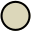
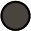
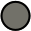
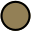

  
|                                                         | Name          | Hex       | Usage                      |
| :----------------------------------------:              | :--------     | :------:  | :------------------        |
|      | fujiWhite     | `#DCD7BA` | default foreground         |
|       | sumiInk0      | `#16161D` | dark backgrouns            |
|       | sumiInk1      | `#1F1F28` | default background         |
|       | sumiInk2      | `#2A2A37` |                            |
|       | sumiInk3      | `#363646` |                            |
|       | sumiInk4      | `#54546D` |                            |
|      | waveBlue1     | `#223249` | popup background           |
|      | waveBlue2     | `#2D4F67` | popup selection background |
|    | winterGreen   | `#2B3328` | diff Add                   |
|   | winterYellow  | `#49443C` | diff Change                |
|      | winterRed     | `#43242B` | diff Deleted               |
|     | winterBlue    | `#252535` | diff Line                  |
|    | autumnGreen   | `#76946A` | git Add                    |
|      | autumnRed     | `#C34043` | git Delete                 |
|   | autumnYellow  | `#DCA561` | git Change                 |
|     | samuraiRed    | `#E82424` | diagnostic error           |
|    | roninYellow   | `#FF9E3B` | diagnostic warning         |
|      | waveAqua1     | `#6A9589` | diagnostic Info            |
|     | dragonBlue    | `#658594` | diagnostic Hint            |
|       | oldWhite      | `#C8C093` |                            |
|       | fujiGray      | `#727169` |                            |
|  | springViolet1 | `#938AA9` |                            |
|      | oniViolet     | `#957FB8` |                            |
|    | crystalBlue   | `#7E9CD8` |                            |
|  | springViolet2 | `#9CABCA` |                            |
|     | springBlue    | `#7FB4CA` |                            |
|      | lightBlue     | `#A3D4D5` |                            |
|      | waveAqua2     | `#7AA89F` |                            |
|    | springGreen   | `#98BB6C` |                            |
|    | boatYellow1   | `#938056` |                            |
|    | boatYellow2   | `#C0A36E` |                            |
|     | carpYellow    | `#E6C384` |                            |
|     | sakuraPink    | `#D27E99` |                            |
|        | waveRed       | `#E46876` |                            |
|       | peachRed      | `#FF5D62` |                            |
|   | surimiOrange  | `#FFA066` |                            |
|     | katanaGray    | `#717C7C` |                            |

