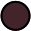
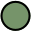
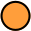
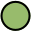
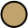
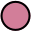

|                                                         | Name          | Hex       | Usage                        |
| :-----------------------------------------------------: | :------------ | :-------: | :-------------------------   |
|      | fujiWhite     | `#DCD7BA` | Default foreground           |
|       | oldWhite      | `#C8C093` | Dark foreground              |
|       | sumiInk0      | `#16161D` | Dark background              |
|       | sumiInk1      | `#1F1F28` | Default background           |
|       | sumiInk2      | `#2A2A37` | Lighter background           |
|       | sumiInk3      | `#363646` | Lighter background           |
|       | sumiInk4      | `#54546D` | Lighter background           |
|      | waveBlue1     | `#223249` | Popup background             |
|      | waveBlue2     | `#2D4F67` | Popup selection background   |
|    | winterGreen   | `#2B3328` | Diff Add (background)        |
|   | winterYellow  | `#49443C` | Diff Change (background)     |
|      | winterRed     | `#43242B` | Diff Deleted (background)    |
|     | winterBlue    | `#252535` | Diff Line (background)       |
|    | autumnGreen   | `#76946A` | Git Add                      |
|      | autumnRed     | `#C34043` | Git Delete                   |
|   | autumnYellow  | `#DCA561` | Git Change                   |
|     | samuraiRed    | `#E82424` | Diagnostic Error             |
|    | roninYellow   | `#FF9E3B` | Diagnostic Warning           |
|      | waveAqua1     | `#6A9589` | Diagnostic Info              |
|     | dragonBlue    | `#658594` | Diagnostic Hint              |
|       | fujiGray      | `#727169` | Comments                     |
|  | springViolet1 | `#938AA9` | Light foreground             |
|      | oniViolet     | `#957FB8` | Statements and Keywords      |
|    | crystalBlue   | `#7E9CD8` | Functions and Titles         |
|  | springViolet2 | `#9CABCA` | Brackets and punctuation     |
|     | springBlue    | `#7FB4CA` | Specials and builtins        |
|      | lightBlue     | `#A3D4D5` | Not used                     |
|      | waveAqua2     | `#7AA89F` | Types                        |
|    | springGreen   | `#98BB6C` | Strings                      |
|    | boatYellow1   | `#938056` | Not used                     |
|    | boatYellow2   | `#C0A36E` | Operators, RegEx             |
|     | carpYellow    | `#E6C384` | Identifiers                  |
|     | sakuraPink    | `#D27E99` | Numbers                      |
|        | waveRed       | `#E46876` | Standout specials 1          |
|       | peachRed      | `#FF5D62` | Standout specials 2          |
|   | surimiOrange  | `#FFA066` | Constants, imports, booleans |
|     | katanaGray    | `#717C7C` | Deprecated                   |
